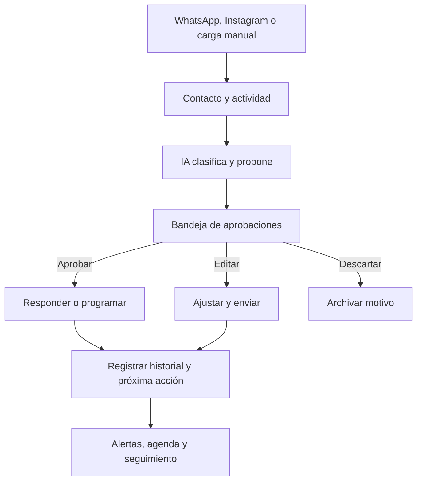

# Copiloto operativo para agentes inmobiliarios

**Documento de producto — Producto DOOH, arquitectura SaaS desde el inicio y validación comercial**
**Fecha:** 31 de julio de 2026
**Versión:** 2 — reemplaza el enfoque "uso interno primero, SaaS después" por "producto DOOH, SaaS desde el diseño inicial"

## 0. Qué cambia respecto a la versión anterior

La versión original (29/07/2026) planteaba construir el sistema como herramienta interna de Fernanda y su hijo, validarla 6-8 semanas, y recién después evaluar si convenía convertirla en un micro-SaaS.

Esta versión parte de una decisión distinta: **el producto se construye desde el día uno como un producto de DOOH para monetizar por suscripción mensual**, al estilo OpenAI/ChatGPT (cuenta, planes, fee recurrente). Esto no significa saltear la validación: Fernanda y su hijo siguen siendo los primeros usuarios reales, y desde temprano pueden sumarse otros usuarios conocidos/beta — pero la arquitectura, el pricing y el posicionamiento se piensan como producto desde el principio, no como una migración posterior.

Lo que **no cambia**: el problema que resuelve, la filosofía "IA propone, humano aprueba", el enfoque agent-first/WhatsApp-first, y el alcance funcional del MVP descrito en las secciones 5 a 8.

Lo que **sí cambia**: arquitectura de datos (multi-tenant desde el inicio), roadmap (sin fase separada de "aislamiento futuro"), y el marco de validación comercial (beta abierta a conocidos en paralelo al uso propio, no como paso posterior).

## 1. Resumen ejecutivo

El proyecto es un producto SaaS —desarrollado y operado por DOOH— para que agentes inmobiliarios gestionen contactos, conversaciones, seguimientos, visitas y oportunidades desde un único centro de control. Los primeros usuarios son Fernanda y su hijo, seguidos tempranamente por un grupo reducido de agentes conocidos en modalidad beta.

No es un sistema para administrar una inmobiliaria ni un portal de publicación de propiedades. Es un **copiloto operativo para agentes**, centrado en el trabajo cotidiano: recibir consultas, entenderlas, responder a tiempo, coordinar acciones y no perder oportunidades.

La inteligencia artificial no reemplaza al agente ni envía mensajes sensibles de forma autónoma. Clasifica, ordena, propone respuestas y alerta; las personas revisan, aprueban y sostienen la relación comercial.

La estrategia es construir el producto con arquitectura multi-tenant desde el inicio, operarlo primero con Fernanda/hijo y un puñado de agentes beta, y escalar la base de clientes pagos una vez validado el flujo, bajo la marca DOOH.

## 2. Problema que resuelve

Un agente inmobiliario suele trabajar con consultas dispersas entre WhatsApp, Instagram, llamadas y contactos cargados a mano. Esto genera problemas recurrentes:

- mensajes sin responder o respondidos tarde;
- seguimiento inconsistente de clientes interesados;
- falta de claridad sobre quién debe actuar y cuándo;
- historial fragmentado entre chats, notas y memoria personal;
- coordinación difícil de visitas, llamados y propuestas;
- riesgo de que dos personas respondan el mismo contacto;
- CRMs inmobiliarios complejos, pensados para agencias, propiedades, portales y administración general, en vez del día a día del agente.

La promesa del producto es sencilla:

> "Estos mensajes requieren respuesta; estos clientes se están enfriando; estas son las visitas de hoy; esta es la respuesta sugerida. Aprobala, editála o descartála."

## 3. Usuarios iniciales y roles

### Primeros usuarios (organización piloto)

| Rol | Responsabilidad principal |
|---|---|
| Fernanda | Control de calidad, priorización, base de datos, automatizaciones, borradores y aprobación de mensajes |
| Agente comercial (hijo) | Respuesta comercial, coordinación de visitas, muestras, negociación y cierre |

A estos se suman, desde etapas tempranas, agentes conocidos invitados como usuarios beta, cada uno en su propia organización aislada (ver sección 9).

### Regla operativa central

Cada contacto debe tener siempre:

- un responsable;
- un estado comercial;
- una próxima acción;
- una fecha para esa acción;
- historial de interacciones y decisiones.

Esto evita respuestas duplicadas y seguimientos perdidos.

## 4. Propuesta de valor

**Copiloto operativo para agentes inmobiliarios:** unifica conversaciones, contactos, tareas, visitas y oportunidades; la IA prepara y prioriza; el agente aprueba y vende.

El diferencial no será "tener más funciones" que un CRM tradicional, sino ser:

- **agent-first:** diseñado desde el flujo real de un agente, no de una inmobiliaria completa;
- **WhatsApp-first:** preparado para que el canal central de Latinoamérica sea parte natural del flujo;
- **simple:** parecido a gestionar una red social, no a operar un CRM pesado;
- **con aprobación humana:** la IA sugiere, las personas deciden;
- **orientado a próxima acción:** ninguna oportunidad queda sin una acción futura clara;
- **usable por duplas y equipos pequeños:** asignación, coordinación y visibilidad compartida;
- **producto, no proyecto interno:** pensado desde el inicio para múltiples clientes bajo la marca DOOH, con cuentas, planes y aislamiento de datos por organización.

## 5. Alcance funcional del MVP

### Pantallas principales

| Sección | Función |
|---|---|
| Inicio | Resumen diario: mensajes nuevos, pendientes, visitas, clientes sin seguimiento y oportunidades activas |
| Bandeja de mensajes | Conversaciones de canales conectados y carga manual, con clasificación y borrador sugerido |
| Contactos | Ficha unificada del cliente: necesidad, historial, responsable, estado y próxima acción |
| Propiedades | Inventario propio de inmuebles y datos relevantes para vincular a búsquedas |
| Matching | Sugerencia básica de propiedades compatibles para cada búsqueda y de interesados para cada propiedad |
| Agenda | Visitas, llamados, tasaciones y recordatorios compartidos |
| Seguimientos | Lista priorizada de acciones para hoy, mañana y la semana |
| Reportes | Leads, velocidad de respuesta, visitas, oportunidades activas y cierres |

### Datos mínimos de un contacto

- Nombre, teléfono, canal de origen y datos de contacto.
- Tipo de operación: compra, alquiler, tasación, publicación u otra consulta.
- Zona, presupuesto, tipo de propiedad, ambientes, requisitos y urgencia.
- Estado comercial y responsable.
- Historial de mensajes, llamadas, visitas, propiedades enviadas y notas.
- Próxima acción y fecha.

### Estados sugeridos

`Nuevo` → `Calificado` → `Visita` → `Negociación` → `Cerrado`

Estados complementarios: `En pausa`, `Descartado`, `Sin respuesta`, `Reactivar`.

## 6. Flujo de trabajo ideal

Ejemplo de tarjeta de aprobación:

> **Laura — consulta por 3 ambientes en Caballito**
> Detectado: compra, hasta USD 150.000, necesita cochera.
> Acción sugerida: pedir teléfono y ofrecer dos opciones compatibles.
> Acciones: **Aprobar · Editar · Descartar**

## 7. Agentes/asistentes de IA

No se plantea un agente generalista autónomo. El sistema debe usar asistentes pequeños, trazables y con responsabilidades delimitadas.

| Asistente | Acción automática | Requiere aprobación humana |
|---|---|---|
| Recepción | Identifica contacto, crea/actualiza ficha y extrae intención, zona, presupuesto y urgencia | Primera respuesta y cualquier dato sensible |
| Redacción | Prepara borrador acorde al contexto y tono | Envío del mensaje |
| Seguimiento | Detecta contactos sin respuesta y propone siguiente acción/fecha | Texto y prioridad final |
| Matching | Cruza necesidades con propiedades compatibles | Qué propiedad ofrecer y a quién contactar |
| Visitas | Propone confirmaciones, recordatorios y seguimiento posterior | Reprogramaciones y compromisos |
| Investigación | Resume comparables, zona o datos disponibles | Información a comunicar externamente |
| Control comercial | Genera resumen diario/semanal de pendientes, oportunidades y alertas | Decisión de prioridades |

### Reglas no negociables

- La IA no envía mensajes de forma autónoma durante la etapa inicial.
- La IA nunca confirma precio final, disponibilidad definitiva, condiciones legales, reserva o documentación.
- Toda recomendación de IA debe quedar ligada al contacto y a la actividad que la originó.
- Cada mensaje enviado y cada respuesta recibida debe registrarse en el historial.
- Las acciones de aprobación, edición y descarte deben quedar auditadas.

## 8. Integraciones y entrada de datos

La aplicación debe ser independiente de canales: el núcleo es la base de datos propia. Los canales son entradas intercambiables.

| Entrada | Etapa | Uso |
|---|---|---|
| Carga manual | MVP inicial | Alta rápida de contacto, búsqueda, visita, propiedad o nota de llamada |
| WhatsApp Business Cloud API | Integración posterior | Leer y registrar conversaciones; preparar y aprobar respuestas |
| Instagram profesional vía Meta | Integración posterior | Incorporar mensajes directos a la misma bandeja |
| Llamadas y encuentros | MVP inicial | Registrar un breve resumen y generar el próximo paso |
| Google Calendar | Etapa posterior | Sincronizar visitas y recordatorios compartidos |

Las integraciones de Meta deberán usar APIs oficiales. Esto protege los números/cuentas y permite trabajar dentro de las reglas de la plataforma. Para WhatsApp, los mensajes iniciados fuera de la ventana de atención de 24 horas deben usar plantillas aprobadas y pueden tener costo por conversación/mensaje según categoría y país.

## 9. Arquitectura recomendada

### Principios

1. Base de datos propia y estructurada: el negocio no debe depender de una planilla ni de una herramienta cerrada.
2. Arquitectura modular: cada integración y automatización puede evolucionar sin rehacer el núcleo.
3. Seguridad y trazabilidad desde el inicio: usuarios, permisos, auditoría y respaldos.
4. Interfaz muy simple, núcleo preparado para crecer.
5. **Multi-tenant desde el inicio:** aislamiento por organización (`organizations`) implementado en el modelo de datos y en la capa de permisos desde la Fase 1, no como migración futura. La organización de Fernanda/hijo es el primer tenant, no un caso especial sin aislamiento.

### Stack inicial

| Componente | Tecnología sugerida | Motivo |
|---|---|---|
| Aplicación web | Next.js | Interfaz moderna, rápida y escalable |
| Hosting | Netlify Free (luego plan pago con dominio propio DOOH) | Suficiente para desarrollo y beta, con URL gratuita y HTTPS; migración a dominio propio al lanzar comercialmente |
| Base de datos y autenticación | Supabase / PostgreSQL | Datos relacionales, usuarios, permisos, aislamiento por organización (Row Level Security) y crecimiento ordenado |
| Automatizaciones | n8n autoalojado | Flujos extensibles con menor dependencia de costos por operación |
| IA | API de OpenAI | Clasificación, borradores, resúmenes, extracción de datos y matching básico |
| Canales | Meta Cloud API + Instagram profesional | Integraciones oficiales para WhatsApp e Instagram |
| Agenda | Google Calendar | Visitas y recordatorios compartidos |
| Facturación/suscripciones | A definir (ej. Stripe/MercadoPago) | Necesario desde que se sume el primer cliente pago fuera del piloto |

Make puede utilizarse para pruebas rápidas o flujos auxiliares, pero no debería ser el corazón del sistema.

### Modelo de datos base

Las entidades mínimas serán:

- `organizations`: tenant de cada agente/equipo — aislamiento de datos activo desde el primer usuario, incluyendo Fernanda/hijo;
- `users`: usuarios, roles y permisos, vinculados a una organización;
- `subscriptions`: plan contratado, estado de pago y límites de uso por organización;
- `contacts`: personas y datos de contacto;
- `contact_requirements`: búsqueda, presupuesto, zona y requisitos;
- `properties`: inmuebles y atributos;
- `conversations` y `messages`: canal, contenido, clasificación y estado;
- `activities`: llamadas, notas, visitas, propiedades enviadas y eventos;
- `tasks`: próxima acción, vencimiento, responsable y estado;
- `appointments`: visitas, llamados y agenda;
- `matches`: relaciones sugeridas entre búsqueda y propiedad;
- `approvals`: borradores, decisiones, comentarios y auditoría.

## 10. UX/UI: criterios de diseño

La experiencia debe sentirse como una bandeja de oportunidades, no como un software administrativo.

- Priorizar vistas diarias: "qué requiere atención ahora".
- Mostrar contexto y acción sugerida en una sola tarjeta.
- Reducir carga manual con extracción automática y formularios cortos.
- Usar filtros simples: responsable, estado, vencido, canal y prioridad.
- Permitir que al abrir un chat se marque "en gestión por…" para evitar duplicación.
- Adaptación responsive para computadora y celular.
- Pensar como PWA: instalable desde navegador, sin necesidad de tienda de aplicaciones para el MVP.
- Identidad visual DOOH desde las primeras pantallas orientadas a usuarios externos (login, onboarding, landing), dado que el producto se presenta bajo esa marca.

## 11. Seguridad, propiedad de datos y operación

- Cada persona accede con su propio usuario; no se comparte contraseña para operar.
- Cada organización (tenant) tiene sus datos aislados del resto, incluida la de Fernanda/hijo.
- Puede usarse un Gmail gratuito exclusivo como cuenta administrativa, titular y de recuperación de servicios, mientras no se opere bajo dominio propio.
- La autenticación en dos pasos y los métodos de recuperación deben quedar documentados.
- Aplicar permisos por usuario y registro de actividad.
- Programar respaldos y controlar restauración antes de depender del sistema en producción, especialmente antes de sumar el primer usuario externo al piloto.
- Al conectar canales o datos de terceros de cada cliente beta, documentar autorización, titularidad de los datos y reglas de uso por organización.

Para la etapa de desarrollo y piloto cerrado, una URL gratuita (`nombre-del-proyecto.netlify.app`) alcanza para trabajar con login y HTTPS. Un dominio propio de DOOH se adopta al pasar a beta abierta/comercialización, no es indispensable desde el primer día.

## 12. Roadmap de desarrollo

### Fase 0 — Descubrimiento y diseño

- Definir flujos reales de trabajo, estados, campos y reglas de aprobación.
- Diseñar pantallas clave en Figma, incluyendo login/onboarding con identidad DOOH.
- Modelar base de datos multi-tenant y criterios de seguridad desde el inicio.
- Definir qué se carga manualmente y qué se automatiza después.
- Definir estructura inicial de planes y pricing (ver sección 14) aunque el cobro no arranque de inmediato.

### Fase 1 — Centro de control funcional (multi-tenant desde el inicio)

- Login y organizaciones/usuarios (Fernanda + hijo como primer tenant).
- Contactos, propiedades, tareas, agenda e historial manual, con aislamiento por organización.
- Estados, responsable y próxima acción obligatoria.
- Inicio con métricas y alertas simples.
- Bandeja de aprobaciones sin envío automatizado.
- Flujo de alta de nueva organización, para poder invitar agentes beta sin trabajo extra de arquitectura.

### Fase 2 — Canales, colaboración y beta con agentes conocidos

- Integración oficial con WhatsApp e Instagram, cuando las cuentas y permisos estén disponibles.
- Ingreso automático de mensajes y vínculo con contactos.
- Gestión de responsabilidad de conversaciones.
- Calendario y recordatorios compartidos.
- Invitación de un grupo reducido de agentes conocidos como usuarios beta, cada uno en su propia organización.

### Fase 3 — IA y automatizaciones

- Clasificación y extracción estructurada de datos.
- Borradores de respuesta aprobables.
- Detección de seguimientos vencidos.
- Matching básico de búsqueda y propiedades.
- Resumen diario/semanal y reportes iniciales.

### Fase 4 — Monetización y escalamiento

- Definir e implementar cobro por suscripción (planes de la sección 14).
- Onboarding self-service o asistido para nuevos agentes/equipos.
- Dominio propio DOOH y materiales de marca para adquisición.
- Soporte, facturación y métricas de uso por organización.

## 13. Costos

### Desarrollo contratado vs. desarrollo propio con Codex

La estimación de desarrollo contratado incluía definición funcional, arquitectura, UX/UI, programación, integraciones, pruebas, seguridad y despliegue. Al construirlo Fernanda con Codex, ese gasto se reemplaza principalmente por tiempo propio y servicios externos.

| Alcance contratado de referencia | Estimación |
|---|---:|
| MVP operativo | USD 3.000–5.500 |
| MVP profesional recomendado | USD 5.500–9.000 |
| Versión expansible, por etapas | USD 10.000–18.000 |

Para construcción propia, un MVP sólido puede requerir aproximadamente **160–280 horas**, distribuibles por módulos y compatible con la validación temprana. Sumar el diseño multi-tenant desde el inicio no cambia significativamente este rango: es más una decisión de modelado de datos que de esfuerzo adicional relevante.

### Costo técnico estimado al comenzar

| Concepto | Desarrollo/validación | Operación con beta externa |
|---|---:|---:|
| Hosting web Netlify | USD 0 | USD 0 mientras alcance el plan gratuito |
| Base de datos Supabase | USD 0 en desarrollo | USD 0 al inicio; plan pago recomendado al sumar el primer tenant externo |
| Automatizaciones n8n | USD 0–15/mes | USD 6–20/mes |
| API de IA | USD 5–20/mes | USD 10–50/mes según uso, prorrateable entre organizaciones |
| WhatsApp oficial | USD 0 de configuración | Variable por plantillas y uso, por organización |
| Dominio propio DOOH | USD 0 mientras se use URL gratuita | A definir al pasar a comercialización |
| Facturación/suscripciones | USD 0 en piloto | Comisión de la pasarela de pago al activar cobros |

Rango orientativo: **USD 30–80 mensuales** para desarrollar/probar y **USD 50–120 mensuales** al operar con el piloto y primeros agentes beta, sin contar eventuales costos de mensajería de Meta ni impuestos.

Advertencia: los planes gratuitos de base de datos son adecuados para desarrollo y validación, pero no conviene depender de ellos apenas haya datos reales de clientes externos. En esa etapa se priorizarán continuidad, respaldos y monitoreo por encima del costo cero.

## 14. Oportunidad de mercado y monetización

### Lectura del mercado

Existen CRMs inmobiliarios y plataformas conversacionales, pero la mayoría se concentra en administración de inmobiliarias, publicación en portales, gestión de equipos o ecosistemas de Estados Unidos. Hay una oportunidad para un producto más liviano, localizado y centrado en el agente independiente que usa WhatsApp como canal principal.

Competidores/referencias relevantes:

| Categoría | Ejemplos | Aprendizaje |
|---|---|---|
| CRM inmobiliario | Tokko Broker, Inmovilla | El mercado paga por gestión de propiedades y leads, pero estas plataformas suelen ser amplias y orientadas a inmobiliarias |
| CRM de agentes/equipos | Follow Up Boss | Valida que un agente paga por seguimiento y automatización, aunque está orientado a EE. UU./MLS |
| CRM conversacional | Kommo | Valida el valor de bandeja omnicanal, pero no resuelve el flujo inmobiliario de forma nativa |

La oportunidad debe tratarse como **micro-SaaS especializado de DOOH**, no como una aplicación masiva ni una publicación temprana en una store.

### Modelo de ingresos posible

| Plan | Cliente | Precio de referencia | Incluye |
|---|---|---:|---|
| Inicial | Agente individual | USD 12–15/mes | Contactos, tareas, agenda, propiedades, seguimiento e IA limitada |
| Pro | Agente activo | USD 25–30/mes | Bandeja, borradores, alertas, matching y reportes |
| Equipo | Duplas/equipos pequeños | USD 55–75/mes | 2–4 usuarios, asignación, coordinación y agenda compartida |
| Implementación | Clientes que requieran ayuda | USD 80–180 único | Configuración, importación, plantillas y capacitación |

La IA y WhatsApp no deben ofrecerse como consumo ilimitado. Se puede incluir una cuota razonable y cobrar extras por créditos o uso adicional.

Fernanda/hijo y los agentes beta iniciales pueden operar sin cargo o con un plan fundador simbólico mientras dure la validación; el modelo de precios ya queda definido en la arquitectura (tabla `subscriptions`) para activarse sin rehacer el sistema.

### Escenarios de facturación

Tomando como referencia el plan Pro de USD 25/mes:

| Clientes pagos | Facturación mensual | Facturación anual |
|---:|---:|---:|
| 10 | USD 250 | USD 3.000 |
| 50 | USD 1.250 | USD 15.000 |
| 100 | USD 2.500 | USD 30.000 |
| 150 | USD 3.750 | USD 45.000 |

Esto representa facturación bruta, no ganancia. Al inicio, el costo dominante será soporte, onboarding y adquisición de clientes, no infraestructura.

### Validación comercial

1. Usarlo con Fernanda/hijo como primer tenant real desde el arranque de la Fase 1.
2. Invitar tempranamente a un grupo reducido de agentes conocidos como usuarios beta (Fase 2), cada uno aislado en su propia organización.
3. Medir tiempo de respuesta, seguimientos recuperados, visitas agendadas, oportunidades reactivadas y horas ahorradas, por organización.
4. Ofrecer a los beta un plan fundador acompañado, con expectativa de pago al terminar el período de prueba, en lugar de una prueba indefinida.
5. Considerar validado el producto si al menos tres de cinco agentes beta lo usan semanalmente y aceptan pagar al terminar el período inicial.

La señal de valor no será "les gusta la IA", sino que el producto ayude a responder a tiempo, recuperar una oportunidad o concretar una visita que de otro modo se habría perdido.

## 15. Decisiones vigentes

- Se construye primero como app web privada y responsive; no como app nativa para stores.
- El producto se desarrolla y opera bajo la marca DOOH, con arquitectura multi-tenant desde el inicio.
- Fernanda y su hijo son el primer tenant/caso de uso real; agentes conocidos se suman como beta desde etapas tempranas, no como paso posterior a una validación cerrada.
- Los contactos pueden llegar por WhatsApp, Instagram o carga manual.
- La base de datos es propia; el sistema no depende de planillas.
- No se necesita dominio propio para el piloto cerrado; se evalúa dominio DOOH al pasar a beta abierta/comercialización.
- Un Gmail exclusivo puede ser la cuenta administrativa inicial mientras no haya dominio propio.
- La IA propone y asiste; las personas aprueban los mensajes y decisiones comerciales.
- El aislamiento por organización se construye desde la Fase 1, no se pospone a una fase de "SaaS futuro".
- La monetización se diseña desde el inicio (planes, tabla `subscriptions`) aunque el cobro efectivo se active de forma gradual, empezando por agentes beta.

## 16. Próximos pasos recomendados

1. Confirmar nombre del producto y propuesta breve bajo la marca DOOH.
2. Documentar el flujo exacto de un lead desde el primer mensaje hasta el cierre o descarte.
3. Diseñar en Figma las pantallas iniciales: Inicio, Bandeja, Contacto, Tareas/Agenda, Propiedades, y login/onboarding con identidad DOOH.
4. Crear proyecto técnico: repositorio (ya existe cuenta de GitHub), Netlify y Supabase en plan gratuito, con modelo `organizations`/`subscriptions` desde el primer commit.
5. Construir Fase 1 sin esperar integraciones de Meta, con aislamiento multi-tenant activo desde el principio.
6. Cargar casos reales de Fernanda/hijo y probar el flujo a diario.
7. En paralelo a la validación interna, identificar y preparar la invitación a los primeros agentes beta conocidos.
8. Antes de invitar al primer agente beta, resolver Términos de Servicio, Política de Privacidad y la consulta legal de protección de datos (sección 17).
9. Recién cuando el núcleo esté validado con el piloto y los beta, solicitar/configurar canales oficiales, incorporar IA y activar cobros.

## 17. Revisiones profesionales pendientes

Este documento cubre bien el diseño de producto, funcionalidad y arquitectura técnica, pero para que el proyecto sea legalmente sólido y rentable —no solo funcional— faltan miradas de otros perfiles profesionales que no están cubiertas acá:

### Legal / protección de datos — **bloqueante antes del primer beta externo**

- El sistema va a almacenar datos personales de terceros (contactos de clientes de cada agente) por cuenta de otra organización. Esto activa la Ley 25.326 de Protección de Datos Personales (Argentina) y probablemente exige inscripción como responsable/encargado de tratamiento de datos.
- Faltan Términos de Servicio y Política de Privacidad antes de invitar a cualquier agente beta con contactos reales.
- Falta definir un acuerdo de tratamiento de datos entre DOOH y cada organización cliente (qué pasa con los datos si el cliente deja de pagar, exportación, borrado, etc.).
- Revisar términos de uso de Meta Cloud API (WhatsApp/Instagram) para el modelo de reventa/multi-cliente, no solo para uso propio.
- **Se recomienda una consulta puntual con un abogado especializado en protección de datos antes de sumar el primer agente beta con datos de clientes reales.**

### Financiero / contable

- Falta un modelo de unit economics (costo de adquisición, retención esperada, ingreso por cliente vs. costo de soporte e infraestructura por organización).
- Falta definir el mecanismo de cobro: Stripe no opera de forma directa en Argentina, por lo que hay que evaluar MercadoPago, Paddle o Lemon Squeezy como intermediarios, y el impacto del cepo cambiario si se cobra en USD.
- Falta definir si el SaaS factura bajo la estructura actual de DOOH o conviene una figura separada por temas impositivos y de responsabilidad.
- Se recomienda una consulta con un contador/asesor financiero antes de activar el primer cobro real (Fase 4).

### UX / investigación con usuarios

- El diseño de estados, campos y prioridades está validado solo con la experiencia de Fernanda y su hijo. Antes de escalar a beta conviene contrastarlo con 2-3 agentes ajenos al núcleo familiar, para detectar sesgos de un caso único.
- Recomendable una ronda de entrevistas o testeo de las pantallas de Figma con esos agentes antes de construir la versión final de cada pantalla.

### Seguridad

- Falta un análisis de amenazas formal y la definición de objetivos de recuperación (RTO/RPO) para los respaldos, algo esperable antes de manejar datos de clientes de terceros a través de múltiples organizaciones.
- Recomendable una revisión de seguridad (aunque sea informal, con checklist) antes de abrir el primer tenant externo.

Ninguno de estos puntos frena el inicio del desarrollo técnico del MVP (Fase 0-1 con Fernanda/hijo como único tenant). El punto verdaderamente bloqueante es el legal/protección de datos, y aplica en el momento en que se invite al primer agente beta con contactos reales de terceros — no antes.
